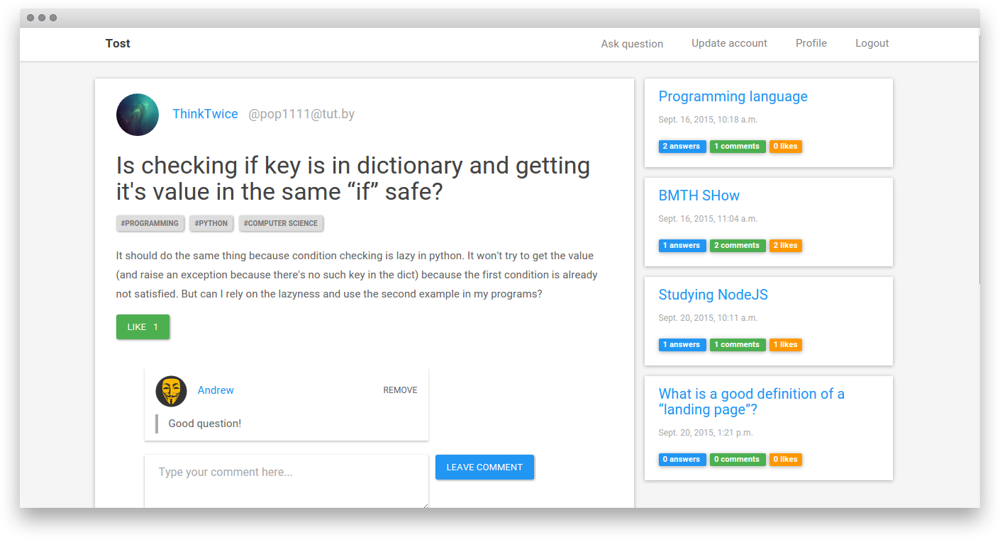
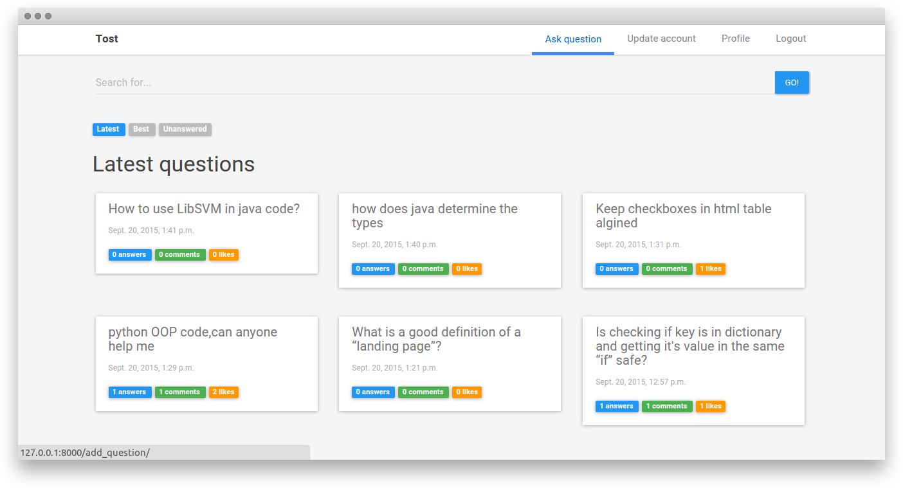
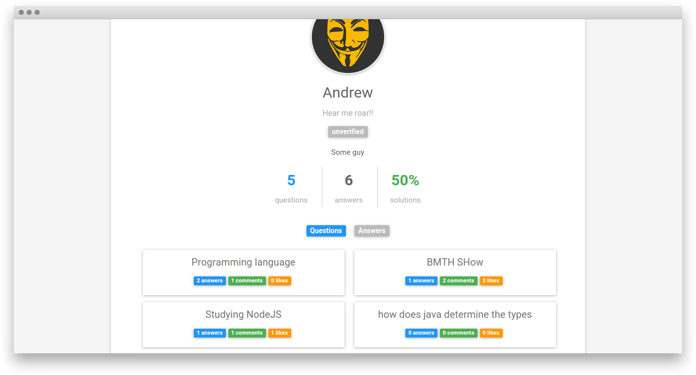
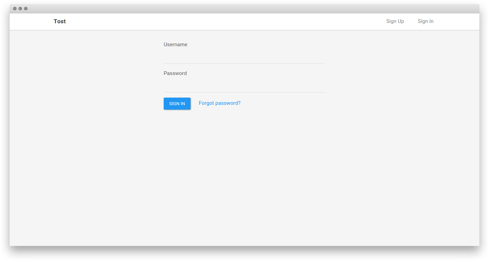

# Toster clone application

This is a simple [toster](https://toster.ru/) clone with almost whole its functionality reproduced. The users are able to:

+ sign up and sign in, 
+ update their accounts, 
+ ask questions, 
+ give answers, 
+ comment and like questions and answers both.

This application created using ***Python*** and its framework ***Django***.

 
After the registration the users get verification email. Emails are also sent when users sign in or modify thier account data. All the email sending are handled using ***Celery*** in order not to make users wait and do all this stuff asyncronously.

Question detail page and profile page contain certain amount of client-side logic which interfere with the application's API. Client side code is written using ***JavaScript*** and its library ***ReactJS***. API is created using ***Django Rest Framework*** and its extension for nested routing - ***DRF Nested Routers***.

In order to make form look a little bit pretty I've used ***Django Bootstrap Form*** package and also to provide the admin interface with some modern flat apperance ***Django Flat Theme*** package was used.

***MySQL*** was chosen as a database for this project.